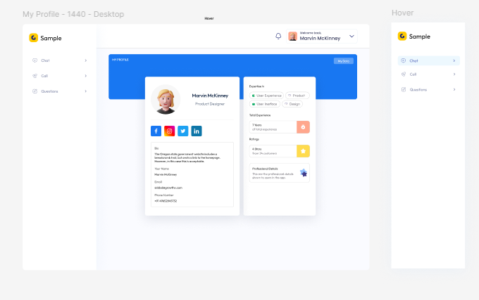
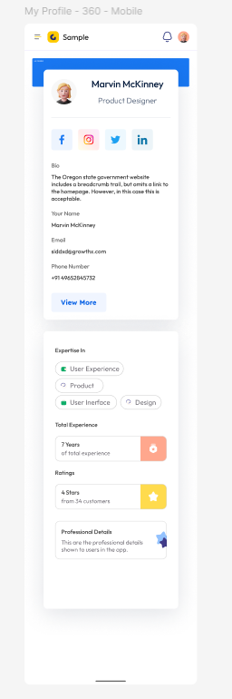

# چالش ساخت صفحه پروفایل (۳۵۰ امتیاز)

در این چالش باید بر اساس یک طراحی مشخص شده در Figma، صفحه‌ی پروفایل کاربر را پیاده‌سازی کنید.
برای دریافت امتیاز هر بخش باید ویژگی مورد نظر آن را پیاده سازی نمایید.

طراحی باید هم از نظر ظاهری و هم از نظر تجربه کاربری تا جای ممکن شبیه به نمونه‌ی ارائه‌شده باشه.
عکس‌های این دیزاین در پایین قرار داده شده. شما میتوانید برای مشاهده‌ی دقیق طراحی‌ها به صفحه‌ی
[**فیگما**](https://www.figma.com/design/ROgfDeaNo7XntoG5cQgzyP/Profile?node-id=0-1&t=Swt6BGdzyDmfvkzg-1)ی پروژه مراجعه کنید.

  

### بخش اول — پیاده‌سازی کلی ساختار (HTML + CSS) (۱۴۰ امتیاز)

- رعایت سلسله‌مراتب تگ‌ها و دسترسی‌پذیری (accessibility) امتیاز مثبت دارد.

 

### بخش دوم — ریسپانسیو بودن (۷۰ امتیاز)

- طراحی باید در دستگاه‌های مختلف (موبایل، دسکتاپ) درست نمایش داده شود.
- منوها یا لی‌آوت‌ها باید در موبایل به صورت مناسب تغییر کنند.
- فونت‌ها و اندازه کارت‌ها باید متناسب با سایز صفحه تغییر کند.

 

### بخش سوم — تعاملات ساده با جاوااسکریپت (۶۰ امتیاز)

- افکت hover روی کارت‌ها یا دکمه‌ها
- امکان ویرایش اطلاعات کاربر در محل (inline editing)

 

## بخش چهارم — کدنویسی تمیز و قابل توسعه (۴۰ امتیاز)

- کلاس‌های مناسب و توصیفی
- استفاده از CSS متغیرها یا utility class‌ها (مثلاً در Tailwind)
- ساختار ماژولار و مرتب فایل‌ها

  

### بخش پنجم — جزئیات ظاهری و فونت و آیکون (۴۰ امتیاز)

- فونت مناسب و مطابق طراحی
- آیکون‌ها، رنگ‌ها و سایه‌ها مطابق Figma
- آواتارها یا تصاویر جایگزین مشابه طراحی انتخاب شوند
